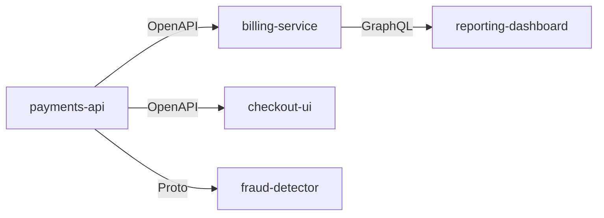

# Ripple — Self-Maintaining APIs

> When you change an API, Ripple finds every consumer and opens PRs to fix them. Automatically.

### 🌐 [**Live Landing Page**](https://ripple-cnn.pages.dev/) · [**Install GitHub App**](https://github.com/apps/ripple-api) · [**Install GitLab**](https://ripple-production-be7f.up.railway.app/auth/gitlab) · [**Try Dry-Run**](https://ripple-production-be7f.up.railway.app/dry-run) · [**CI/CD Gate**](#cicd-gate-ripple-check) · [**Self-Hosted Agent**](#self-hosted-agent)

[](https://github.com/apps/ripple-api)
[](https://github.com/Aakash2408/ripple-sdk-python/pull/1)
[](https://github.com/Aakash2408/ripple-sdk-node/pull/1)
[](https://github.com/Aakash2408/ripple-sdk-java/pull/1)
[](https://ripple-production-be7f.up.railway.app/dashboard)

## The Problem

You change `POST /users` to require a new field. Three teams find out when their code breaks in production on Friday night.

## The Solution

Ripple detects breaking API changes, finds every consumer, generates the fix, and opens a PR — in seconds, not days.

```
RIPPLE — API Change Propagation

⚠️  1 breaking change detected:
  POST /payments — added required field 'idempotency_key' (string)

🔍 Found 3 consumers (Python SDK, Node SDK, Java SDK)
🔧 Generated 3 fixes (validated ✓)
📤 Opened 3 PRs

✅ Done in 15 seconds.
```

## Try It (No Install)

See what would break before installing anything:

👉 [**Dry-Run Mode**](https://ripple-production-be7f.up.railway.app/dry-run)

Paste your old and new spec → see breaking changes instantly. No repo access needed. No PRs opened.

---

## CI/CD Gate (Ripple Check)

Block PRs that introduce breaking changes with unfixed consumers — like `buf lint` but for change **propagation**, not just detection.

Add to `.github/workflows/ripple-check.yml`:

```yaml
name: Ripple Check
on: [pull_request]
jobs:
  ripple:
    runs-on: ubuntu-latest
    steps:
      - uses: actions/checkout@v4
        with:
          fetch-depth: 0
      - uses: Aakash2408/ripple-check@v1
        with:
          token: ${{ secrets.GITHUB_TOKEN }}
          contract-types: "openapi,proto,graphql"
          fail-on-breaking: true
          monorepo: true
```

**What it does:**
1. Detects spec files changed in the PR (OpenAPI, Proto, GraphQL, Avro, Thrift, Smithy, AsyncAPI, JSON Schema)
2. Calls the Ripple analysis engine to identify breaking changes
3. Posts a PR comment with the full impact report
4. Fails the check if breaking changes have unfixed consumers

**Inputs:**

| Input | Required | Default | Description |
|---|---|---|---|
| `token` | ✅ | — | GitHub token for API access |
| `contract-types` | — | `openapi,proto,graphql` | Comma-separated types to check |
| `fail-on-breaking` | — | `true` | Fail check if breaking changes detected |
| `monorepo` | — | `false` | Scan within the same repo for consumers |
| `consumers-path` | — | — | Glob patterns to scan for consumers |

**Outputs:** `breaking-changes`, `consumers-affected`, `status` (pass/warn/fail), `report` (markdown)

---

## Monorepo Support

Ripple scans **within your repo** for consumers — not just across repos. Perfect for monorepos where API producers and consumers live side-by-side.

**How it works:**
- Uses `git grep` with naming variants (snake_case, camelCase, PascalCase, kebab-case) to find in-repo references
- Confidence scoring: generated code (95%), imports (85%), usage (80%), test files (75%)
- Automatically enabled when `monorepo: true` is set in the CI/CD gate or `.ripple.yaml`

**In `.ripple.yaml`:**

```yaml
settings:
  monorepo: true
  consumers_path: "services/**,clients/**"  # optional: restrict scan scope
```

Works with all 10 contract types. Combines with cross-repo scanning — Ripple checks both your monorepo AND external consumer repos.

---

## Install

**Option 1: GitHub App (recommended)**

Install on your org — Ripple auto-triggers on every push:

👉 [**Install Ripple**](https://github.com/apps/ripple-api)

That's it. Push a breaking change to any API spec and fix PRs appear in consumer repos.

**Option 2: Run from source**

```bash
git clone https://github.com/Aakash2408/ripple.git
cd ripple
pip install -r requirements.txt

# Detect breaking changes
python -m app.cli diff old.yaml new.yaml

# Find consumers + generate fixes
python -m app.cli run old.yaml new.yaml --repos ./consumer1 ./consumer2

# Deploy as webhook (auto-triggers on push)
uvicorn app.webhook:app --port 8000
```

## How It Works

1. **Detect** — Parses API contracts (OpenAPI, Protobuf, GraphQL, database schemas) and finds breaking changes
2. **Find** — Scans your org's repos for code that calls the changed endpoint
3. **Fix** — Generates the minimal code fix for each consumer. Fix templates cover 8-15 languages depending on the change type; **none is validated end-to-end yet** (see `tools/audit_capabilities.py`) (Python, TypeScript, Java, Go, Rust, Ruby, Kotlin, C#, Swift, PHP, Scala, Dart) with LLM fallback for any other language
4. **Validate** — Syntax-checks every fix before opening a PR
5. **PR** — Opens a pull request with the fix, confidence badge, and clear explanation
6. **Visualize** — Maps your full dependency graph (`/graph` endpoint) in ASCII, Mermaid, or D3 format

## Learning — what is built, and what is actually running

Ripple has five learning channels in the codebase. **None of them is currently
active in the hosted deployment**, so today every fix comes from the
deterministic template layer. This section tracks the gap honestly rather than
describing the design as though it were live.

| Channel | Built | Active in prod | Blocker |
|---|---|---|---|
| Co-change from git history | ✅ | ❌ | needs a local clone (`git -C <path> log`); the hosted server has none, and the graph is in-memory only |
| Merged-PR pattern indexing | ✅ | ❌ | runs only on the `installation` webhook event, which does not re-fire for existing installs |
| PropBench pattern pre-load | ✅ | ❌ | `propbench_data/` is not vendored here — the 882 entries live in the separate PropBench repo |
| Consumer graph | ✅ | ⚠️ | rebuilt per run, not persisted (`/health/storage` reports `durable: false` until a volume is mounted) |
| Multi-invoker detection | ✅ | ✅ | runs per-change, no stored state required |

What this means in practice: the RAG retriever executes on every fix and
correctly reports `No RAG pattern or cluster match` because its store is empty.
That is the system being honest, not the system working. Fixes are labelled
`[RAG/template]`, and the PR body attributes them to the template layer.

Two things that **are** live and do improve detection over plain grep:

- **Multi-invoker detection** — warns when a shared config or schema has several
  consumers, which is the "I deleted a block and broke an unrelated service"
  failure.
- **Pattern playbooks** — proto changes also touch `*_pb2.py`, `*.pb.go`, and
  test files; language-aware variant generation matches `phone_number`,
  `phoneNumber`, and `PhoneNumber` rather than one casing.

## Change Impact Report

Every PR/MR Ripple opens includes a **Change Impact Report** — a full manifest of what was changed, what was scanned but left alone, and why:

```
### ✅ Changed (auto-fixed)
| File | Category | What was done |
| client.py | 💻 code | Removed broken field reference |

### ⚠️ Needs Manual Review
| File | Category | Why | References |
| tests/test_user.py | 🧪 test | References `phone_number` | L42: `assert user.phone_number...` · L67: `mock_user(...)` |
| docs/api.md | 📝 docs | Documents the field | L18: `| phone_number | string |...` |

### 📝 Deliberately Left Alone
| Category | Status | Details |
| ⚙️ Config | ✅ Safe | No config references detected |
```

**Line-level references** — shows exact line numbers + code snippets, not generic "check your tests." Supports naming variants (snake_case, camelCase, PascalCase, UPPER_SNAKE, kebab-case).

Ripple only auto-fixes code that would **break**. Docs, examples, and tests that still pass are flagged but not modified — you decide.

## Expand+Contract Advisor

Warns when a breaking change could be done non-breakingly:

```
💡 This change (removing field `phone_number`) could be done safely using
   the expand-and-contract pattern:
   1. Mark field as deprecated (keep it)
   2. Remove all consumers
   3. Then remove the field
```

Helps teams avoid breaking changes entirely when possible.

## Multi-Language Fix Generation

Ripple has fix templates for up to 15 languages natively (8-15 per change type; consumer matching is language-specific for 11 of them), with LLM fallback for anything else:

| Language | Engine | Fix Quality |
|---|---|---|
| Python | AST-aware (libcst) | Idiomatic, preserves formatting |
| TypeScript | AST-aware (ts-morph) | Type-safe, handles generics |
| Java | AST-aware (JavaParser) | Handles annotations, generics |
| Go | AST-aware (go/ast) | gofmt-compliant output |
| Rust | AST-aware (syn) | Lifetime/ownership-aware |
| Ruby | Pattern-based + AST | Rails conventions respected |
| Kotlin | AST-aware (KotlinParser) | Coroutine/suspend-safe |
| C# | AST-aware (Roslyn) | Nullable reference types aware |
| *Any other* | LLM fallback (GPT-4) | Context-aware, validated |

**How the LLM fallback works:**
- If the consumer file is in a language without a native engine, Ripple sends the breaking change + file context to GPT-4
- The generated fix is syntax-validated before opening a PR
- Confidence score is adjusted (typically 70-85% vs 90-98% for native engines)

Every fix — native or LLM — is syntax-checked and dry-run validated before opening a PR.

## Dependency Graph Visualization

See your entire API dependency graph at a glance:

```
GET /graph?org={org}&format={ascii|mermaid|d3}&filter={contract_type}
```

**Formats:**

| Format | Use Case | Output |
|---|---|---|
| `ascii` | Terminal / Slack | Box-and-arrow text diagram |
| `mermaid` | Docs / README / wikis | Mermaid flowchart syntax |
| `d3` | Interactive exploration | HTML page with D3.js force graph |

**Filtering options:**

| Parameter | Example | Description |
|---|---|---|
| `format` | `mermaid` | Output format (default: ascii) |
| `filter` | `openapi,proto` | Only show edges for these contract types |
| `depth` | `2` | Max hops from root (default: unlimited) |
| `root` | `payments-api` | Center graph on this service |
| `highlight` | `breaking` | Color-code nodes with recent breaking changes |
| `include-stale` | `false` | Hide consumers not seen in 30+ days |

**Example (Mermaid output):**



The graph is rebuilt from the current scan on every push. It is not yet
persisted between runs — `/health/storage` reports `durable: false` until a
volume is mounted — so it reflects the latest push rather than accumulated
history.

## AI Confidence Badge

Every PR Ripple opens includes a **confidence badge** showing how certain Ripple is about the fix:

```
🟢 Confidence: 96% — High confidence fix (AST-validated, pattern-matched)
🟡 Confidence: 78% — Medium confidence (LLM-generated, syntax-validated)
🔴 Confidence: 45% — Low confidence (best-effort, needs manual review)
```

**What drives the score:**

| Factor | Impact |
|---|---|
| Native AST engine (vs LLM) | +15-20% |
| Co-change history match | +10% |
| File seen in prior successful fixes | +8% |
| Monorepo (same-repo consumer) | +5% |
| Test file coverage detected | +5% |
| Multiple naming variant matches | +3% |

Badges appear in the PR title and body. CI/CD gates can be configured to only auto-merge above a threshold (e.g., `min_confidence: 0.85` in `.ripple.yaml`).

**Confidence is not clearance.** Every PR also carries a safety level decided by
the capability registry, not by confidence:

| Level | Meaning |
|---|---|
| 🟢 `AUTO` | The registry has cleared this language × contract × operation: a transformation exists, validation passes, and an end-to-end fixture proves it. |
| 🟡 `REVIEW` | A fix was produced but something is unproven. The PR opens, states the reasons, and asks for a human. |
| 🔴 `BLOCKED` | No PR. |

**Exactly one cell is `AUTO`: `typescript × openapi × remove_field`.** It earned it
— a syntax-aware transformation that refuses shapes it cannot remove safely,
`tsc --noEmit` in a container against the generated code, and an end-to-end fixture
whose named test runs the whole path. `python tools/audit_capabilities.py` reports
1 of 48 fixable cells production-ready and recomputes that from the code.

The other 1,799 combinations are `REVIEW`. Removing either the validation or the
end-to-end evidence takes `AUTO` away, which is asserted in the suite.

**Measured against a real repository, the golden path does not complete.**
`python tools/verify_real_repo.py` clones `billing-api`, finds its one TypeScript
consumer, removes the two dead interface declarations, and then **refuses** the
remaining two references: a function parameter (removing it breaks every caller) and
a shorthand object property. Terminal state `BLOCKED`, with both refusals named by
line. The cell is production-ready for the shapes it handles; real code contains
shapes it correctly declines. Widening it is a decision about safety, not a bug fix. `app/routing.py` derives the level by asking
`app/capability_claims.py`; it keeps no list of its own, and CI fails if it grows one.

**GitHub is the only live surface.** The GitLab and Bitbucket integrations are
switched off — all 11 of their routes (webhooks, OAuth, setup) return `501` with
a stated reason, because they bypass the routing decision and the outcome funnel,
so a breaking change on those paths could terminate in silence. Re-enable with
`RIPPLE_ENABLE_EXPERIMENTAL_PLATFORMS=1`. `/dry-run` and the GitHub App are
unaffected.

**Scope, stated honestly: safety levels currently apply to the GitHub path only.**
`pr_level()` is reachable from `github_webhook` and not from the other four
PR-creating entry points — the GitLab and Bitbucket webhooks each inline their own
pipeline in the route handler, the CLI goes through `pr_engine`, and the self-hosted
agent is a separate package. On those paths a fix can still be opened without a
stated safety level or a recorded outcome. `python tools/audit_pipeline_governance.py`
gates CI on that set never growing, and fails if an exemption is left behind after a
path is fixed. Unifying them is P0.1 and is not done.

## Research: PropBench

Ripple is backed by **PropBench** — a research benchmark for measuring
engineering judgment in change propagation:

- **882** real engineering changes (640 open-source + 242 internal) from **50** repositories across **10** languages
- **1,223** consequence files classified into **8** miss categories
- Baseline recall on the benchmark: **7%** file recall from naming conventions alone → **17%** when co-change history is added → **82%** package recall with the full ensemble

Key finding: **39%** of propagation targets are cross-package — invisible to any single-repo tool.

Those recall figures are **results measured on the benchmark**, not a description
of the hosted deployment. Ripple's co-change channel is built but not active in
production (see [Learning](#learning--what-is-built-and-what-is-actually-running)),
so the 17% figure is not what the live service currently delivers.

Paper: [PropBench: A Benchmark for Engineering Judgment in Change Propagation](https://github.com/Aakash2408/Propbench)

## How Ripple Compares

| | **Ripple** | Dependabot | Optic | buf |
|---|---|---|---|---|
| Detects breaking changes | ✅ | — | ✅ | ✅ |
| Finds consumers | ✅ | — | — | — |
| Generates fix code | ✅ | — | — | — |
| Fix languages | 12 + LLM fallback | 0 | 0 | 0 |
| Opens PRs automatically | ✅ | ✅ | — | — |
| CI/CD gate (blocks merge) | ✅ | — | — | ✅ |
| Monorepo support | ✅ | — | — | — |
| Dep graph visualization | ✅ | — | — | — |
| Contract types | 10 | 0 | 1 | 1 |
| Learns from git history | ⚠️ built, not yet active | — | — | — |
| Change Impact Report | ✅ | — | — | — |
| Platforms (7) | ✅ (GH+GL+BB+Phab+Gerrit+CRUX+Git) | GH only | GH only | GH only |
| Self-hosted option | ✅ | — | — | — |

## Custom Playbooks

Add a `.ripple.yaml` to your repo root to teach Ripple about YOUR codebase:

```yaml
playbooks:
  - name: "Our API gateway"
    trigger:
      files: ["api/openapi.yaml"]
      change_types: ["added_required_field", "removed_field"]
    consumers:
      - pattern: "sdk/python/**/*.py"
        confidence: 0.95
        reason: "Python SDK wraps this API"
      - pattern: "sdk/node/**/*.ts"
        confidence: 0.95
        reason: "Node SDK wraps this API"
      - pattern: "tests/integration/**/*"
        confidence: 0.85
        reason: "Integration tests call this API"

  - name: "Database migrations"
    trigger:
      files: ["db/migrations/*.sql", "prisma/schema.prisma"]
      change_types: ["*"]
    consumers:
      - pattern: "src/models/**/*"
        confidence: 0.90
        reason: "ORM models mirror DB schema"

ignore:
  - "*.lock"
  - "node_modules/**"
  - "dist/**"

settings:
  min_confidence: 0.6
  auto_learn: true
  max_prs_per_push: 10
```

Get the template: `GET /config/template`

## Supported Contracts

- [x] OpenAPI / Swagger
- [x] Protobuf (gRPC)
- [x] GraphQL
- [x] Database schemas (SQL DDL + Prisma)
- [x] AsyncAPI (Kafka, SNS/SQS, RabbitMQ, MQTT, NATS, WebSockets)
- [x] Avro (Confluent Schema Registry, Kafka)
- [x] tRPC (TypeScript full-stack)
- [x] Thrift (Apache Thrift, Meta/enterprise RPC)
- [x] JSON Schema (API validation, config schemas)
- [x] Smithy (AWS services IDL)

## Supported Change Types

All 55 change types emitted by the 10 diff engines reach a fix handler, in one of
four categories. Not every category produces a finished fix, and the PR says
which one it got:

| Category | Count | What the PR contains |
|---|---|---|
| **Mechanical** | 27 | a complete deterministic fix |
| **Judgment** | 21 | the safe part applied, the rest marked `RIPPLE-ACTION-REQUIRED` — a value is never invented and logic is never silently deleted |
| **Wire-only** | 2 | no code change, because none is correct — a changed proto field number breaks serialization, not source |
| **Non-breaking** | 1 | nothing, correctly (an added optional field breaks no consumer) |

**OpenAPI:**
- [x] Added required field
- [x] Removed field
- [x] Field type changed (string → integer breaks consumers)
- [x] Endpoint removed (consumers get 404)
- [x] Response field removed (consumers reading it get null)
- [x] Required header added (requests rejected without it)

**Protobuf:**
- [x] Field removed
- [x] Field type changed
- [x] Field number changed (wire incompatibility)
- [x] Required field added
- [x] Message removed
- [x] Message renamed (detected via field overlap)

**GraphQL:**
- [x] Field removed from type
- [x] Field made non-nullable (String → String!)
- [x] Type removed
- [x] Required argument added
- [x] Enum value removed
- [x] Union member removed

**Database:**
- [x] Column removed
- [x] Column type changed
- [x] NOT NULL column added (existing rows fail)
- [x] Column made NOT NULL
- [x] Table removed
- [x] Table renamed

**AsyncAPI:**
- [x] Channel removed (subscribers stop receiving)
- [x] Message payload field removed
- [x] Message payload field type changed
- [x] Required field added to message
- [x] Message removed from components
- [x] Server removed (connection config breaks)

## Supported Languages

- [x] TypeScript / JavaScript
- [x] Python
- [x] Java
- [x] Go
- [x] Rust
- [x] Ruby
- [x] Kotlin
- [x] C#
- [x] Any other language (LLM fallback)

## Deploy

```bash
# Docker (Cloud webhook server)
docker build -t ripple .
docker run -p 8000:8000 -e GITHUB_TOKEN=ghp_xxx ripple

# Railway (one-click deploy)
# Live: https://ripple-production-be7f.up.railway.app
```

## Self-Hosted Agent

For companies with **custom code platforms** (on-prem Git, Phabricator, Gerrit, Amazon CRUX, etc.) or air-gapped networks, Ripple runs as a self-hosted agent.

**Quick start:**

```bash
# One-shot scan
python -m agent.core scan /path/to/your/repo --since "1 day ago"

# Watch mode (polls every 60 seconds)
python -m agent.core watch /path/to/repos --interval 60

# Docker
docker build -f Dockerfile.agent -t ripple-agent .
docker run -v /your/repos:/repos ripple-agent watch /repos --interval 60
```

**Generate sample config:**

```bash
python -m agent.core config > ripple-agent.yaml
```

**Config file (ripple-agent.yaml):**

```yaml
repos:
  - /path/to/api-repo
  - /path/to/another-repo
interval: 60
platform: generic-git  # or: crux, phabricator, gerrit
min_confidence: 0.6
max_fixes_per_scan: 10
```

**Platform adapters:**

| Adapter | For | How it creates fixes |
|---|---|---|
| `generic-git` | Any git repo | Creates branch + commit |
| `crux` | Amazon (code.amazon.com) | Uses `cr` CLI for code reviews |
| `phabricator` | Meta, Uber, Pinterest | Uses `arc diff` CLI or Conduit REST API |
| `gerrit` | Google, Android, Chromium | Pushes to `refs/for/main` or uses Gerrit REST API |

**Phabricator setup:**
```bash
export PHABRICATOR_URL=https://phabricator.yourcompany.com
export PHABRICATOR_TOKEN=cli-xxxxxxxxxxxx
python3 -m agent.core scan /path/to/repo --platform phabricator
```

**Gerrit setup:**
```bash
export GERRIT_URL=https://gerrit.yourcompany.com
export GERRIT_USERNAME=your-username
export GERRIT_PASSWORD=your-http-password
export GERRIT_PROJECT=your/project
python3 -m agent.core scan /path/to/repo --platform gerrit
```

The agent uses the same 5 diff engines and 30 breaking change detections as the cloud version — just runs locally on your network.

## GitLab Support

Ripple works with GitLab with **one-click OAuth install**:

**Option 1: One-Click OAuth (recommended)**

👉 [**Install on GitLab**](https://ripple-production-be7f.up.railway.app/auth/gitlab)

Click Authorize → Ripple auto-installs webhooks on all your projects. Done.

**Option 2: Manual webhook setup**

1. **Set environment variables:**
   ```bash
   GITLAB_TOKEN=glpat-xxxxxxxxxxxx    # Personal/Project access token (api scope)
   GITLAB_WEBHOOK_SECRET=your-secret   # Optional
   ```

2. **Add webhook to your GitLab project:**
   - Go to Settings → Webhooks
   - URL: `https://your-ripple-server.com/webhook/gitlab`
   - Secret token: (same as GITLAB_WEBHOOK_SECRET)
   - Trigger: ✅ Push events
   - Click "Add webhook"

3. **Push a breaking change** — Ripple creates a Merge Request automatically.

Works with all 10 contract types on GitLab.

## Bitbucket Support

Ripple works with Bitbucket Cloud with **one-click OAuth install**:

**Option 1: One-Click OAuth (recommended)**

👉 [**Install on Bitbucket**](https://ripple-production-be7f.up.railway.app/auth/bitbucket)

Click Authorize → Ripple auto-installs webhooks on all your repos. Done.

**Option 2: Manual webhook setup**

1. **Create App Password:**
   - Bitbucket → Settings → App passwords → Create
   - Permissions: ✅ Repositories (read+write), ✅ Pull requests (read+write)

2. **Set environment variables:**
   ```bash
   BITBUCKET_USERNAME=your-username
   BITBUCKET_APP_PASSWORD=your-app-password
   ```

3. **Add webhook to your repository:**
   - Repository → Settings → Webhooks → Add webhook
   - URL: `https://your-ripple-server.com/webhook/bitbucket`
   - Triggers: ✅ Repository Push

4. **Push a breaking change** — Ripple creates a Pull Request with the fix.

## API Reference

```
POST /webhook           — GitHub push events (auto-triggered by GitHub App)
POST /webhook/gitlab    — GitLab push events
POST /webhook/bitbucket — Bitbucket push events
POST /webhook/install   — GitHub App installation (triggers learning)
POST /learn             — Manually trigger co-change learning
GET  /graph             — Dependency graph visualization (ASCII/Mermaid/D3)
GET  /dashboard         — Web UI (monitored repos, activity, stats)
GET  /status/{org}      — What Ripple knows about your codebase (JSON)
GET  /rate-limit/{org}  — Rate limit status for an org
GET  /config/template   — Default .ripple.yaml template
GET  /health            — Server health
GET  /docs              — Swagger UI (auto-generated)
```

## Dashboard

See what Ripple has observed across your org (repos monitored, breaks detected,
PRs opened, languages seen — from the current activity window, not accumulated
history):

```
GET /dashboard        — web UI (monitored repos, activity, stats)
GET /status/{org}     — what Ripple knows about your codebase (JSON)
GET /health           — server health
```

## Why Ripple?

- **Not Dependabot** — Dependabot bumps library versions. Ripple fixes YOUR code when YOUR APIs change.
- **Not a linter** — Linters find style issues. Ripple finds breaking contract violations across repos.
- **Not AI code review** — Code review finds bugs in what you wrote. Ripple fixes what you forgot to update.
- **Not SDK generation** — SDK generators rebuild from scratch. Ripple patches your EXISTING code.

## Contributing — traps worth knowing

Every one of these was a real defect that shipped and had to be found. They are
listed because each has recurred, and because the failures are quiet rather than
loud. Agent-facing detail lives in `.kiro/steering/ripple-invariants.md`.

**The core failure mode is silence, not an error.** If a fix template returns the
code unchanged, `fixed_code == content`, so no PR opens. An unhandled change type
therefore produces *nothing* — Ripple detects a breaking change and stays quiet,
which is worse than not detecting it, because the user believes they are covered.
This is why `tools/coverage_matrix.py` gates CI: it asserts no change type any
engine can emit can reach the fix layer and fall through.

**Underscore is a word character.** `\bLEGACY\b` does not match Go's
`Status_LEGACY`, so protobuf-generated enums slip past a matcher that looks
correct. This has bitten four separate call sites. Use
`(?<![A-Za-z0-9])NAME(?![A-Za-z0-9])`.

**Removing a line orphans what follows it.** Deleting `case X:` leaves that arm's
statements dangling inside the switch, and the file no longer compiles. Removal
has to span to the next `case`, `default`, or closing brace. Same class as
leaving a trailing comma behind in a Go struct literal.

**Declarations come in more than one shape.** `enum Status { LEGACY, ACTIVE }`
inline and the multiline form are different parse problems. Handling one and
missing the other looks identical to full coverage from the outside.

**Never claim the output compiles.** Commenting out `r, err := c.svc.Delete(ctx)`
leaves `return err` referencing an undefined variable. A PR that overstates what
it fixed costs more trust than one that admits a partial fix, so the explanations
carry the caveat and a regression test asserts the false claim is absent.

**Audit the green cells.** The coverage matrix can report zero failures while a
transform quietly matches nothing. Six real defects here were found by
investigating cells that reported "no change" — none by the passing total.

Enable the pre-commit hook once per clone (git will not let a repo configure its
own hooks path):

```bash
git config core.hooksPath .githooks
```

It runs every gate below, plus the suite a second time with `GITHUB_SHA` set as CI sets it (~55s), and **refuses the commit** if any is red — because the
recurring mistake was not too many commits, it was committing and then repairing
the same change in a follow-up commit (`c6b60af`'s message literally names the
commit it should have been part of). Escape with `git commit --no-verify`.

Before pushing (requires Python 3.12+ — `python3` on a dev desktop may be 3.7):

```bash
python tools/check_names.py app/*.py       # NameError before deploy
python tests/test_regression.py            # 121 tests
python tools/audit_diff_engines.py         # 0 false negatives / positives
python tools/audit_change_types.py         # all 47 emitted types classified
python tools/coverage_matrix.py            # 459 combos, 0 escapes
python tools/audit_fail_silent.py --check  # 42 sites, every one classified
python tools/audit_pipeline_governance.py  # 1 of 5 entry points governed
python tools/audit_frozen_surface.py       # 6 frozen modules, 747 statements
python tools/audit_codemod_coverage.py     # automation 60.0%, implementation 85.7%
python tools/audit_negative_corpus.py      # 6 historical false VALIDs, all blocked
python tools/verify_validation.py          # acceptance, needs docker: not a gate
python tools/verify_deployed_capability.py # acceptance: can the LIVE image validate?
```

All eight gate CI. The fail-silent gate does not demand zero silent paths — 25 are
correct-but-invisible and making them visible is P0.4/P0.5 work. It demands that
none is *unexplained*: classified in `tools/fail_silent_triage.py`, no `REAL_BUG`
left standing, and no function that was fixed allowed to go silent again.

## License

MIT
